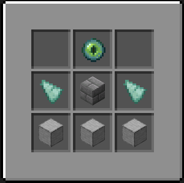
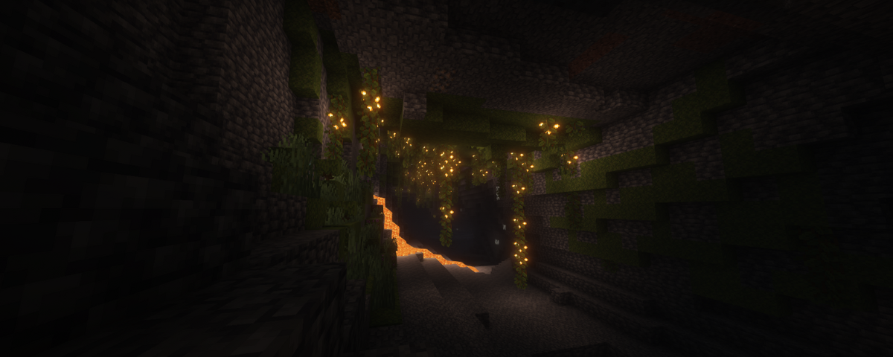

Teleport Stones by [rif223](https://github.com/rif223) and [DustdevDM](https://github.com/DustdevDM)

# Teleport Stones

is a Minecraft 1.21.11 data-pack and resourcepack that allows the use of Teleport Stones to allow quick travel between two coordinates for the low cost of 10 Xp Level.

## Crafting

A Teleport Stone can be crafted with:

- 1 endereye
- 2 prismarine shards
- 3 smoothstone blocks
- 1 stone brick block

they have to arranged like this:



## Server compatibility

With server compatibility in mind, this data-pack is working with servers by force loading all coordinates that contain teleport stones.

You can add the resource-pack for the Teleport Stone Model by changing the following properties in your server.properties file:

```
resource-pack=https\://download.mc-packs.net/pack/9112cdf64d5c2f8c0ec858df53dbe25fd43973da.zip
resource-pack-sha1=9112cdf64d5c2f8c0ec858df53dbe25fd43973da
```

The data-pack must be added to the `data-packs` directory of the main world. You must extract the zip! Restart the server after this procedure.

Lastly, the data-pack must be initialized: `/function teleport:init`

---

## Contributors

## [](https://github.com/OutPlaceDM/TeleportStones/graphs/contributors)


