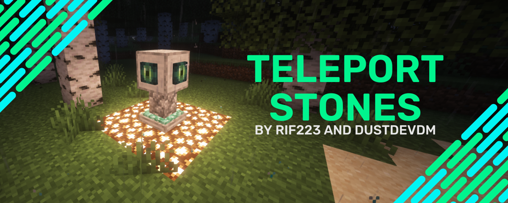

Teleport Stones by [rif223](https://github.com/rif223) and [DustdevDM](https://github.com/DustdevDM)

# Teleport Stones

is a Minecraft 1.20.6 datapack and resourcepack that allows the use of Teleport Stones to allow quick travel between two coordinates for the low cost of one diamond.

## Crafting

A Teleport Stone can be crafted with:

- 1 endereye
- 2 prismarine shards
- 3 smoothstone blocks
- 1 ??? name forgot block

they have to aranged like this:


## Server compatibility

With server compatibility in mind, this datapack is working with servers by forceloading all chunks that contain teleport stones.

You can add the texturepack for the Teleport Stone Model by chnaging the following properties in your server.properties file:

```
resource-pack=https\://download.mc-packs.net/pack/9112cdf64d5c2f8c0ec858df53dbe25fd43973da.zip
resource-pack-sha1=9112cdf64d5c2f8c0ec858df53dbe25fd43973da
```

The datapack must be added to the `datapacks` directory of the main world. You must extract the zip! Restart the server after this procedure.

Lastly, the datapack must be initialized: `/functions ????`
